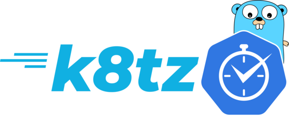
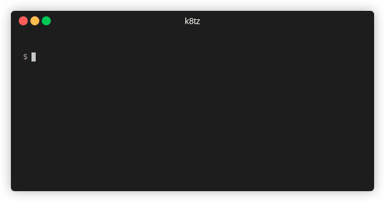

# Kubernetes Timezone Controller


[](https://goreportcard.com/report/github.com/k8tz/k8tz)
[](https://codecov.io/gh/k8tz/k8tz)
[](go.mod)
[](CODE_OF_CONDUCT.md)
[](https://opensource.org/licenses/Apache-2.0)



`k8tz` is a kubernetes admission controller and a CLI tool to inject timezones into Pods.

Containers do not inherit timezones from host machines and have only accessed to the clock from the kernel. The default timezone for most images is UTC, yet it is not guaranteed and may be different from container to container. With `k8tz` it is easy to standardize selected timezone across pods and namespaces automatically with minimal effort.

## Admission Controller with Helm

tl;dr:

```console
helm repo add k8tz https://k8tz.github.io/k8tz/
helm install k8tz k8tz/k8tz --set timezone=Europe/London
```



### Prerequisites
- Helm 3
- Kubernetes >=1.16
- Permissions to use `emptyDir` or `hostPath`

### Installation

First, you need to add k8tz helm repository:

```console
helm repo add k8tz https://k8tz.github.io/k8tz/
```

Then, you can install k8tz admission controller:

```console
helm install k8tz k8tz/k8tz
```

If you want to set some values to configure k8tz, you can use `--set`, e.g:

```console
helm install k8tz k8tz/k8tz \
    --set timezone=Europe/Amsterdam \
    --set injectionStrategy=hostPath
```

Optional: You can use helm to test that installation was successful and the admission controller is running using:

```console
helm test k8tz
```

### Values

| Parameter | Description | Default |
| --------- | ----------- | ------- |
| replicaCount | Amount of admission controller webhooks to spin up. For production use it is recommended to have at least 3 replicas | 1 |
| namespace | The namespace where to install the admission controller | k8tz |
| timezone | The default timezone to inject | UTC |
| injectionStrategy | The default injection strategy to use | initContainer |
| injectAll | If true, timezone will be injected to the pod even when there is no annotation with explicit injection request. When false, the `k8tz.io/inject: true` annotation is required. | true |
| image.repository | The image repository for the admission controller and bootstrap image | quay.io/k8tz/k8tz |
| image.pullPolicy | Admission controller image pull policy | IfNotPresent |
| image.tag | The image tag for the admission controller and bootstrap image. The default is the chart appVersion | - |
| imagePullSecrets | The image pull secrets for the admission controller | [] |
| nameOverride | Helm application name override | - |
| fullnameOverride | Helm application full name override | - |
| serviceAccount.annotations | Annotations to add to the admission controller service account | {} |
| serviceAccount.name | The name of the service account to use. If empty, a name is generated using the fullname template | - |
| podAnnotations | Annotations to add to the admission controller pod | {} |
| podSecurityContext | Pod security context for the admission controller pod | {} |
| securityContext | Security context for the admission controller pod | {} |
| service.type | Admission controller service type | ClusterIP |
| service.port | Admission controller service port | 443 |
| resources | Resource requests and limitations for the admission controller deployment | {} |
| nodeSelector | Node selector for the admission controller deployment | {} |
| tolerations | Tolerations for the admission controller deployment | {} |
| affinity | Affinities and anti-affinities for the admission controller deployment | {} |
| webhook.failurePolicy | Failure policy for the admission webhook. May be `Fail` or `Ignore` | `Fail` |
| webhook.crtPEM | Certificate in PEM format for the admission controller webhook. Will be generated if not specified (Recommended). | - |
| webhook.keyPEM | Private key for in PEM format for the admission controller webhook certificate. Will be generated if not specified (Recommended). | - |
| webhook.caBundle | Certificate Authority Bundle for the admission controller webhook. Will be generated if not specified (Recommended). | - |

### Uninstall

To uninstall k8tz with Helm use:

```console
helm delete k8tz
```

## CLI

`k8tz` can be used as a command-line tool to inject timezone into yaml files or to be integrated inside another deployment script that don't want to use the admission controller automation.

### Examples

You can process the `test-pod.yaml` from file-to-file or directly to `kubectl`:

```console
# to a file
k8tz inject --strategy=hostPath test-pod.yaml > injected-test-pod.yaml

# or directly to kubectl
k8tz inject --timezone=Europe/London test-pod.yaml | kubectl apply -f -
```

Or you can inject to all existing deployments in current namespace:

```console
kubectl get deploy -oyaml | k8tz inject - | kubectl apply -f -
```

NOTE: The injection process is idempotent; you can do it multiple times and/or use the CLI injection alongside the admission controller. Subsequent injections have no effect.

### Download GitHub Release

You can install k8tz binary file by downloading precompiled binary and use it

```console
wget -c https://github.com/k8tz/k8tz/releases/download/v0.3.0/k8tz_0.3.0_linux_amd64.tar.gz -O - | tar xz
chmod +x k8tz
./k8tz version
```

then install it to your `$PATH` with:

```console
sudo install k8tz /usr/local/bin/k8tz
```

### Go Install

If you have `go` installed, you can install `k8tz` with:

```console
go install github.com/k8tz/k8tz@latest
```

### Use Docker

You can use k8tz directly from Docker, here are some examples:

```console
docker run -i quay.io/k8tz/k8tz --help

cat test-pod.yaml | docker run -i quay.io/k8tz/k8tz inject -tPortugal - | kubectl create -f

kubectl get deploy -oyaml | docker run -i quay.io/k8tz/k8tz inject - | kubectl apply -f
```

### From Source

You can build `k8tz` binary from source yourself by simple running:

```console
make compile
```

The created binary will be located at `build/k8tz`, you can then install it to your PATH using:

```console
make TARGET=/usr/local/bin install
```

To uninstall, use `sudo rm -v /usr/local/bin/k8tz`.

## Injection Strategy

Timezone information is defined using Time Zone Information Format files (`TZif`, [RFC-8536](https://datatracker.ietf.org/doc/html/rfc8536)). The Timezone Database contains `TZif` files that represent the local time for many locations around the globe. To set the container's timezone, `/etc/localtime` inside the container should point to a valid `TZif` file which represents the requested timezone. In most images these files do not exist by default, so we need to make them available from inside the container mounted at `/etc/localtime`.

Currently, there are 2 strategies how it can be done:

### Using **hostPath**

If those files (which are located under `/usr/share/zoneinfo`) exist in every node on the cluster (it is the user's responsibility to ensure that), `hostPath` volume can be used to supply the required `TZif` file into the pod. If the required timezone will be missing on the host machine, the pod will be stuck in `PodInitializing` status and will not be started.

### Using bootstrap **initContainer**

Another solution, which is generally safer, is to inject `initContainer` (bootstrap image) to the pod and supply the required `TZif` file using a shared `emptyDir` volume. This is the default method of k8tz.

## Annotations

The behaviour of the controller can be changed using annotations on both `Pod` and/or `Namespace` objects. If the same annotation specified in both, the `Pod`'s annotation value will take place.

| Annotation | Description | Default |
| ---------- | ----------- | ------- |
| `k8tz.io/inject` | Decide whether k8tz should inject timezone or not | `true` |
| `k8tz.io/timezone` | Decide what timezone should be used, e.g: `Africa/Addis_Ababa` | `UTC` |
| `k8tz.io/strategy` | Decide what injection strategy to use, i.e: `hostPath`/`initContainer` | `initContainer` |

## Roadmap

- [ ] Support `StatefulSet` injection
- [ ] Lookup for annotations in pods owner when possible
- [ ] Test and document installation on OpenShift
- [X] Implement `make install` for easier installation from source
- [ ] Add VERBOSE flag to helm
- [ ] Write verbose logs for webhook
- [ ] Fix documentation about `uclibc`

## Known Limitations

`k8tz` has been tested widely with many popular base images and worked perfectly with `alpine`, `amazonlinux`, `busybox` (glibc, musl), `centos`, `clearlinux`, `debian`, `fedora`, `photon`, `ros`, `ubuntu` and many more.

The only limitation found so far is that `uclibc` not respecting TZif files in `/etc/localtime`. Images as `busybox` built with `uclibc` will not be affected by `k8tz`.
